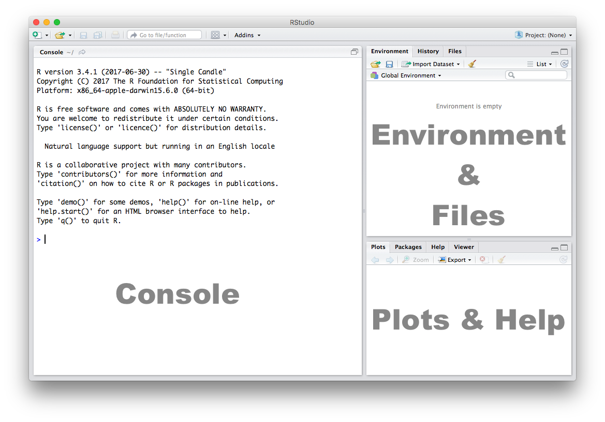
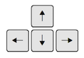

# Introduction to R

## Seminar

Welcome to **POL269**! Throughout this module, you will not only be
learning how to understand the theory and application of quantitative
research, but also how to carry it out yourselves. We will be teaching
you how to **analyse data in `R`**.

In this seminar session, we introduce working with `R`. We illustrate
some **basic functionality** and help you familiarise yourself with the
look and feel of RStudio.

### Getting Started

You should by now have received an email instructing you how to set up
an RStudio Cloud account and how to access the POL269 section. Enter the
project titled Seminar 1.

### RStudio

Let’s get acquainted with `R`. When you start RStudio for the first
time, you’ll see **three panes**:

### Console

The **Console** in RStudio is the simplest way to interact with `R`. You
can type some code in the Console and when you press **ENTER**, `R` will
run that code and give you something back. Depending on what you type,
you may see some output in the Console, or if you make a mistake, you
may get a **warning** or an **error** message. Warnings simply tell you
something might have gone wrong, but do not prevent you from getting an
output. Errors stop your code in its tracks and tell you something is
wrong, so you do not get any output.

Let’s familiarize ourselves with the console by using `R` as a simple
calculator:

    2 + 4

    ## [1] 6

`2 + 4` is so simple that you could type it into Google and get an
answer. But here it is a very basic line of code. The `+` operator has a
meaning in `R`, and it also understands and reads numbers as they are.
So `2 + 4` here is a command, written in `R` code, and the output of
that code is 6. Now that we know how to use the `+` sign for addition,
let’s try some other mathematical operations such as **subtraction**
(`-`), **multiplication** (`*`), and **division** (`/`).

    10 - 4

    ## [1] 6

    5 * 3

    ## [1] 15

    7 / 2

    ## [1] 3.5

<table>
<colgroup>
<col style="width: 73%" />
<col style="width: 26%" />
</colgroup>
<tbody>
<tr class="odd">
<td>You can use the cursor or arrow keys on your keyboard to edit your
code at the console: - Use the UP and DOWN keys to re-run something
without typing it again - Use the LEFT and RIGHT keys to edit</td>
<td></td>
</tr>
</tbody>
</table>

Take a few minutes to play around in the console and try different
things out. Don’t worry if you make a mistake, you can’t break anything
(at least not easily!).

### Functions

If all we ever did was write out simple commands like this, `R` would
become very repetitive and time-consuming. Instead, we use
**functions**: a set of instructions that carry out a specific task.
Functions, generally, take some input and generate some output. For
example, instead of using the `+` operator for addition, we can use the
`sum` function to add two **or more** numbers.

    sum(1, 4, 10)

    ## [1] 15

In the example above, `1, 4, 10` are the inputs and 15 is the output. A
function always requires the **use of parenthesis or round brackets**
`()`. Inputs to the function are called **arguments** and go inside the
brackets. The output of a function is displayed on the screen but we can
also have the option of saving the result of the output. More on this
later.

### Getting Help

A useful function in R is `help`, which we can use to display online
documentation about a function. For example, if we wanted to know how to
use the `sum` function, we could type `help(sum)` and look at the online
documentation.

    help(sum)

The question mark `?` can also be used as a shortcut to access online
help.

    ?sum

Use the toolbar button shown in the picture above to expand and display
the help in a new window.

Help pages for functions in R follow a consistent layout generally
including these sections:

<table>
<colgroup>
<col style="width: 16%" />
<col style="width: 83%" />
</colgroup>
<tbody>
<tr class="odd">
<td>Description</td>
<td>A brief description of the function</td>
</tr>
<tr class="even">
<td>Usage</td>
<td>The complete syntax or grammar including all arguments (inputs)</td>
</tr>
<tr class="odd">
<td>Arguments</td>
<td>Explanation of each argument</td>
</tr>
<tr class="even">
<td>Details</td>
<td>Any relevant details about the function and its arguments</td>
</tr>
<tr class="odd">
<td>Value</td>
<td>The output value of the function</td>
</tr>
<tr class="even">
<td>Examples</td>
<td>Example of how to use the function</td>
</tr>
</tbody>
</table>

### The Assignment Operator

Now we know how to provide inputs to a function using parenthesis or
round brackets `()`, but what about the output of a function?

We use the assignment operator **`<-`** for creating or updating
**objects**. If we wanted to save the result of adding `sum(1, 4, 10)`,
we would do the following:

    myresult <- sum(1, 4, 10)

The line above creates a new object called `myresult` in our environment
and saves the result of the `sum(1, 4, 10)` in it. To see what’s in
`myresult`, just type it in the console:

    myresult

    ## [1] 15

Take a look at the **Environment** pane in RStudio and you’ll see
`myresult` there.

To delete all objects from the environment, you can use the **broom**
button as shown in the picture above.

We called our object `myresult` but we can call it anything as long as
we follow a few simple rules. Object names can contain upper or lower
case letters (`A-Z`, `a-z`), numbers (`0-9`), underscores (`_`) or a dot
(`.`) but all object names must start with a letter. Choose names that
are descriptive and easy to type.

<table>
<thead>
<tr class="header">
<th>Good Object Names</th>
<th>Bad Object Names</th>
</tr>
</thead>
<tbody>
<tr class="odd">
<td>result</td>
<td>a</td>
</tr>
<tr class="even">
<td>myresult</td>
<td>x1</td>
</tr>
<tr class="odd">
<td>my.result</td>
<td>this.name.is.just.too.long</td>
</tr>
<tr class="even">
<td>my_result</td>
<td></td>
</tr>
<tr class="odd">
<td>data1</td>
<td></td>
</tr>
</tbody>
</table>

A good principle to follow is to name your objects so that other people
– including, most importantly **your future self** – can easily work out
what they are. Every person who has ever written code has experienced
coming back to it later and having to start from scratch because they
can’t remember what everything means. Try to avoid this, if possible, by
getting into good habits now!

### Scripts

The Console is great for simple tasks but if you’re working on a project
you should save your work in some sort of a document or a file.
**Scripts** in R are just plain text files that contain R code. You can
edit a script just like you would edit a file in any word processing or
note-taking application. You can also run code directly from it, but
that code doesn’t disappear afterwards. This makes it easy to edit and
improve your code over time, and makes your work **transparent**.

Create a new script using the menu or the toolbar button as shown below.

Once you’ve created a script, it is generally a good idea to give it a
meaningful name and save it immediately. For our first session save your
script as **seminar1.R**

<table>
<colgroup>
<col style="width: 55%" />
<col style="width: 44%" />
</colgroup>
<tbody>
<tr class="odd">
<td>Familiarize yourself with the script window in RStudio, and
especially the two buttons labeled <strong>Run</strong> and
<strong>Source</strong></td>
<td></td>
</tr>
</tbody>
</table>

There are a few different ways to run your code from a script.

<table>
<colgroup>
<col style="width: 24%" />
<col style="width: 75%" />
</colgroup>
<tbody>
<tr class="odd">
<td>One line at a time</td>
<td>Place the cursor on the line you want to run and hit CTRL-ENTER or
use the <strong>Run</strong> button</td>
</tr>
<tr class="even">
<td>Multiple lines</td>
<td>Select the lines you want to run and hit CTRL-ENTER or use the
<strong>Run</strong> button</td>
</tr>
<tr class="odd">
<td>Entire script</td>
<td>Use the <strong>Source</strong> button</td>
</tr>
</tbody>
</table>

### Working with Data

So we know that the basic premise of `R` is that we run code, mostly
functions, on objects. What can we do with this? In most cases of
quantitative research or data science, we use this process to manipulate
and analyse quantitative **data**. In `R`, we typically deal with
**dataframes**. These are like spreadsheets of data that you know from
Microsoft Excel, arranged in columns and rows. But ‘data’, in general,
just means information that is gathered together in some way.

It is easy to create our own dataframe, using the `data.frame()`
function, then see what we have created:

    # create some data
    my_data <- data.frame(0:10, # first column is numbers from 0 to 10
                          20:30) # second column is numbers from 20 to 30

    # summarise dataframe in the console
    my_data

    ##    X0.10 X20.30
    ## 1      0     20
    ## 2      1     21
    ## 3      2     22
    ## 4      3     23
    ## 5      4     24
    ## 6      5     25
    ## 7      6     26
    ## 8      7     27
    ## 9      8     28
    ## 10     9     29
    ## 11    10     30

You can run this code line by line, or all in one go, as you please.
Just make sure you write it in the script and run it from there, as
explained above. There are a few things here you haven’t seen before.
First, everything after a `#` (known as a **comment**) is ignored.
Second, the colon `:` tells `R` to create a **sequence** of all the
numbers in the range specified. We will talk more about sequences next
week.

Looking at `my_data` you’ll see that the columns have strange titles. We
can overwrite this using `colnames()`.

    # add/change column names
    colnames(my_data) <- c("tens", "twenties")

    # did it work?
    my_data

    ##    tens twenties
    ## 1     0       20
    ## 2     1       21
    ## 3     2       22
    ## 4     3       23
    ## 5     4       24
    ## 6     5       25
    ## 7     6       26
    ## 8     7       27
    ## 9     8       28
    ## 10    9       29
    ## 11   10       30

There is another new function introduced here: `c()`. This stands for
**concatenate** which basically means ‘bring together’. It is what we
use in `R` to create **vectors**. We will discuss this more next week.

This dataframe shows you, at a basic level, the format we use to deal
with data in `R`, but it is not very interesting. Usually, we take data
from external sources such as surveys or official statistics, import
them into `R`, and analyse this more interesting data. In later seminars
we will use datasets on topics such as election results, COVID-19 and
political systems. Today we use a very small dataset of the heights and
weights of some women in the USA.

This dataset is available by default in `R`, so we can simply load it
using the `data` function. You can see a full list of the data stored by
default in `R` by running `data()` (with no arguments in the brackets).
Usually we will need to use different functions, such as `read.csv`, to
load more interesting, comprehensive datasets from the internet. We will
do this in future tutorials.

    # open the default 'women' dataset from within R
    data(women)

We can confirm the type of object ‘women’ is using `class()`:

    class(women)

    ## [1] "data.frame"

We can also look at the **contents** of the object. Data frames can
sometimes be too large to show in the console, so we usually look at the
beginning of the dataset - `head()` - or the end - `tail()`.

    # show first six rows
    head(women)

    ##   height weight
    ## 1     58    115
    ## 2     59    117
    ## 3     60    120
    ## 4     61    123
    ## 5     62    126
    ## 6     63    129

    # show last six rows
    tail(women)

    ##    height weight
    ## 10     67    142
    ## 11     68    146
    ## 12     69    150
    ## 13     70    154
    ## 14     71    159
    ## 15     72    164

Just looking at the numbers like this, it is not easy to see how they
are related. A useful way to understand any relationship between
different variables is to **plot** them. It is easy to generate plots in
`R`. We’ll explore this a lot more in future tutorials.

    # scatterplot
    plot(women$height, women$weight)

To get to know a bit more about the file you have loaded `R` has a
number of useful functions. We can use these to find out how many
columns (**variables**) and rows (**cases**) the dataframe (dataset)
contains.

    # number of columns
    ncol(women)

    ## [1] 2

    # number of rows
    nrow(women)

    ## [1] 15

    # column headings
    names(women)

    ## [1] "height" "weight"

    # or
    colnames(women)

    ## [1] "height" "weight"

Sometimes we are only interested in certain parts of dataframes. In `R`
there are two ways of selecting an individual column. The first uses the
`$` symbol to select columns.

    # select the weight column

    women_weight <- women$weight

    head(women_weight)

    ## [1] 115 117 120 123 126 129

A second approach is to use `[Row, Column]`:

    # select only second column
    women_weight <- women[,2] # leave the row section blank to get all rows

    head(women_weight)

    ## [1] 115 117 120 123 126 129

This same approach can be used to select certain **rows**:

    # select only first row
    one_woman <- women[1,] # leave the column section blank to get all column

    one_woman

    ##   height weight
    ## 1     58    115

    # get only the first woman's weight
    one_weight <- women[1,1]

    one_weight

    ## [1] 58

This seminar has introduced you to the **basics** of using `R`. From
next week onwards, we will begin to apply this more practically to
analysing and learning about our data. To make sure you have grasped the
basics and are thinking about `R` in the right way, try out the
exercises below before next time.

### Exercises

1.  Create a script and call it assignment01. Save your script.
2.  Download this
    [cheat-sheet](http://github.com/rstudio/cheatsheets/raw/master/base-r.pdf)
    and go over it. You won’t understand most of it right away. But it
    will become a useful resource. Look at it often.
3.  Calculate the square root of 1369 using the `sqrt()` function.
4.  Square the number 13 using the `^` operator.
5.  What is the result of summing all numbers from 1 to 10?
6.  Load up the default data `quakes` from `R` in the same way you
    loaded the `women` data. Use `?quakes` to find out more about this
    dataset.

-   Look at the first 6 rows of `quakes`.
-   Using the `[Row, Column]` approach, find out how many stations
    reported the 18th earthquake in the dataset.
-   Extract the `mag` column from the `quakes` dataset using the `$`
    operator. Call this new object `quake_mags`.
-   Generate a simple plot of the number of stations reporting an
    earthquake (`stations`) by its magnitude (`mag`). What do you notice
    about the relationship? Why might this be the case?

1.  Save your R script by pressing the Save button in the script window.
